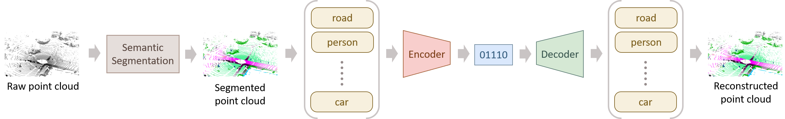

# CACTUS: Content-Aware Compression and Transmission Using Semantics for Automotive LiDAR Data

### Dependencies installation

To install the required dependencies from the project root 
folder and from within an anaconda environment run

```
conda env create -f environment.yml
```

This will create a conda environment called *CAC* that 
contains all the required dependencies.

### What is the project about


The main idea of the project is to use Semantic Segmentation to 
subdivide the point cloud (PC) into partitions that can 
be independently encoded.
This allows for very flexible bitrate allocation and in this way 
it is possible to transmit also class information almost for free.

### Installation
```
mkdir dataset
mkdir dataset/kitti
mkdir dataset/raw
mkdir dataset/compressed
mkdir dataset/rec
mkdir dataset/tmp
mkdir figures
```
Inside dataset/kitti put 3 folders
* dataset/kitti/velodyne: contains the geometry of the first 100 samples from the 08 sequence of the kitti dataset
* dataset/kitti/gt: contains the ground truth of the first 100 samples from the 08 sequence of the kitti dataset
* dataset/kitti/pred: contains the predictions made by randlanet of the first 100 samples from the 08 sequence of the kitti dataset
All files should be npy format and with the name that goes from 000000 to 000100

### Usage
The main script seg\_comp.py has two requird arguments:
* codec: can be either draco or tmc13 and specifies which of the 
two should be used as the codec after segmentation.
* codecs\_path: contains the path in which you can find the installation folder for TMC13 and draco (i.e. the folder where you find the cloned repo)
so in general a usage example would be 

```
python seg_comp.py --codec=tmc13 --codecs_path=~/codecs/
```

This will already plot and save in the figures folder some of the plots reported in the paper.
In order to obtain the plots with the miou data you need to run the generate\_new\_labels.py script as follows:

```
python generate_new_labels.py --codecs_path=~/codecs/
```

Additionally you need to take the point clouds compressed with TMC13 with the 6 different values of qp and run randlanet on them to obtain the predictions and put all the predictions in the folders
```
dataset/kitti/qp_pred/{qp}
```
Where {qp} has value that ranges between 0 and 6
At this point run 
```
python generate_new_labels.py --codecs_path=~/codecs/
```
And you will get the execution time plot, the mIoU plot and some additional figures.

